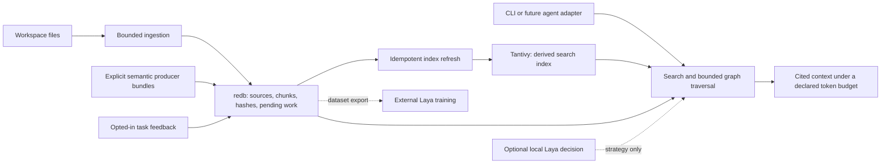

# Architecture

Status: first slice implemented. Each planned capability is identified below.
This is a design and ownership contract, not a performance claim.

## Product contract

A coding agent supplies a query and an output budget. The engine returns relevant
source spans and useful relationships, with citations, freshness, and explicit
limits. Updates replace a source's owned content atomically. Models can improve
selection but cannot decide whether a source exists or rewrite source truth.

The product is intended to store explicit user memories and local task feedback.
Feedback exists in the first slice; a separate user-memory service does not. Learning
improves a bounded decision such as retrieval strategy; it does not create a new
general agent or require training before the engine is useful.

## Two storage alternatives

**One SQLite database with FTS and relational adjacency.** Source replacement,
metadata, graph facts, and lexical search share a transaction. A caller uses
`replace_source(input)` and `context(query, budget)` without index coordination.
This has the simplest application consistency story. It introduces a C database
dependency, and graph queries and FTS tokenization need workload validation.

**One Rust transactional store plus a rebuildable Rust search index.** A `redb`
transaction owns source versions, content, graph adjacency, explicit memories,
and pending index work. Tantivy owns only lexical search acceleration. After a
source commit, an idempotent indexer deletes/replaces that source's search documents,
commits the search index, then clears only the matching pending version. A crash
repeats that work. Queries validate candidate source versions against authoritative
state and report indexing lag; they never label a behind index as complete.

**Selected: redb plus Tantivy**, to keep the application and its principal storage
and search libraries in Rust. This adds a durable pending-work table and freshness
checks that SQLite FTS would not need. That cost is accepted explicitly; the two
files do not jointly constitute one atomic commit. Neither choice needs an
application-owned WAL, checkpoint format, generation allocator, or mutation-specific
fast path. Library implementation details remain the libraries' responsibility.

## Module boundaries

Keep one crate and one command-line binary until separate packages have real users.
Use ordinary modules for store, source ingestion, retrieval, graph, context packing,
and the Laya protocol. The CLI is a thin caller of the same library API used by an
agent adapter. Do not introduce a plugin framework or a generic execution planner.

Source ownership is keyed by workspace and canonical relative path. Every source
version has a content hash. Derived facts additionally name their producer and its
revision. Replacing one producer's facts cannot remove another producer's facts.
Source changes make old semantic evidence ineligible until refreshed.

The graph module persists both adjacency directions in one producer-import
transaction. Source replacement is a separate transaction; endpoint hashes make
old facts ineligible immediately after the source commit. The current traversal
accepts direction, depth and an examined-edge cap and exposes staleness/truncation.
It visits file neighborhoods; symbol resolution and edge-kind filtering are future
work. Evidence classes remain producer declarations, not certifications by the
importer. Real compiler adapters must verify their own resolution contract.

Exact paths and identifiers take precedence on locator queries. Lexical retrieval
is always available. Dense retrieval is an optional, versioned derived index, not
a duplicate mandatory lexical-vector substrate. Graph expansion enriches the
selected evidence rather than generating another long sequence of tool calls.

Context packing counts the fully rendered context text, including citations and
omission notices, using a declared tokenizer or a clearly named conservative bound.
Do not estimate a model's tokens by dividing characters by a constant. Keep source
text verbatim in the first cut; whole-span selection and deduplication come before
new compression algorithms. Expose further retrieval for omitted spans.

The current CLI does not add a protocol envelope to context stdout. A future MCP
adapter must reserve its own envelope overhead; it cannot claim the existing text
token count covers a larger serialized response. Direct search JSON has a hit cap,
not a token budget. File paths and line spans are the current follow-up locators.

## Commit and failure ordering

| Operation | Durable owner and failure behavior |
| --- | --- |
| Replace/delete source | One redb transaction changes metadata, owned chunks and the pending index row. Failure before commit preserves the prior version. |
| Refresh search | Read at most 128 pending sources; delete and insert their search documents; commit Tantivy; reload its reader; then clear only matching pending hashes in redb. An interruption repeats the same replacement. |
| Search during index lag | Check each candidate against the redb source hash; reject stale candidates and report pending work. New versions can be temporarily absent from search. |
| Missing whole search index | Durably mark all stored sources pending before recreating the index metadata; `refresh` fills it. An existing corrupt index is a named error, not silently repaired. |
| Graph import | Validate all endpoints and bounds before replacing a producer's old bundle in one transaction. A rejected bundle leaves the prior bundle intact. |
| Incomplete workspace scan | Keep unseen sources because absence was not established; report failures. Known unsupported inputs are explicit exclusions and retire their previous indexed content. |
| Laya failure | Timeout, invalid response, unknown action or confidence below threshold selects a deterministic strategy and reports the reason. Retrieval remains available. |

The library tests exercise interruption between source and search commits by
reopening with pending work. They do not simulate power loss inside either database
library. The prototype has one process owning a store; even reads open the database
and index writer, so concurrent CLI processes are not a supported serving topology.
Do not add process retries and lock stealing as a substitute for one serving owner.

Schema version 1 rejects other versions. There is no predecessor-store reader or
automatic migration. The first compatibility promise is source rebuildability;
feedback must be exported before replacing an incompatible store. A future schema
change must either migrate preserved user data explicitly or refuse with instructions.

## Learning through Laya

The core remains Rust. Existing Laya inference and training stay in a separately
managed local runtime; rewriting PyTorch or Laya in Rust is outside this boundary.

1. Collect explicitly opted-in query/outcome examples locally. Record successful
   strategy labels supplied by an operator or a real task checker; clicks and a
   model's own answer are not correctness labels.
2. Freeze a versioned dataset and split by task/session or repository so repeated
   examples cannot cross training, calibration, and evaluation boundaries.
3. Train a candidate with Laya outside the serving process. Retain replay examples
   from earlier rounds. Data growth triggers a bounded batch; an interaction does
   not immediately mutate production weights.
4. Calibrate on a separate split and compare with the current deterministic strategy
   and incumbent model on held-out tasks. Report accuracy, abstention, latency, and
   actual token/provider usage where available. Fewer tokens with worse results
   does not qualify as an improvement.
5. Promote an explicitly selected local candidate, retain the previous artifact,
   and support one-step rollback. Unavailable, incompatible, malformed, or low-
   confidence model output falls back to the deterministic strategy.

Laya's current `laya-serve` supports named packaged checkpoints, so a custom-trained
candidate needs a small real local serving adapter around `Agent(local_path)`.
Do not claim candidate deployment merely because the existing endpoint accepts a
`model` string. No weights or training data are included in the source release.

## Release discipline

Ship an installable, limited vertical slice first. Its release checks cover its
actual contract: update/delete/reopen, stale evidence, graph bounds, budget bounds,
and a CLI interaction on a small public fixture. Optional learning and dense
retrieval do not gate the lexical/graph core.

Large-codebase scaling and cost improvements need real workload evidence before
those claims appear in release notes. Such experiments answer a named decision,
have a budget, and run once for that decision; they do not form an endless
prerequisite chain for unrelated releases.

## Scale without recreating a database

The first implementation is useful for a bounded repository snapshot. Its path
set, whole-producer bundle replacement, fixed candidate window and single-process
CLI are known constraints. Large repositories require paged reconciliation,
per-source producer updates, stable symbol identity and one long-lived serving
owner. Those changes stay above library transactions. Add a dense index only when
lexical and graph retrieval demonstrably miss the required concept queries.

No custom scheduler, immutable publication tree, temporal graph history, vector
quantizer, fleet cost governor, or learned compression engine is part of this cut.
This is a scope decision; it does not discard the goals of useful memory, freshness,
large-repository support, quality or economics. The [roadmap](roadmap.md) assigns
those goals to independently usable releases.

Library references: [redb](https://docs.rs/redb/4.3.0/redb/),
[Tantivy](https://docs.rs/tantivy/0.26.2/tantivy/).
