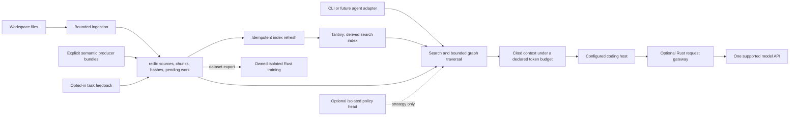

# Architecture

Status: first slice implemented. Each planned capability is identified below.
This is a design and ownership contract, not a performance claim.

The [spec portfolio](../specs/README.md) now owns planned capability sequencing;
the [constitution](../.specify/memory/constitution.md) owns evidence policy. The
explicitly marked first-slice descriptions below remain the current implementation boundary. Future
specs do not retroactively make planned features implemented or approved.

## Product contract

A coding agent supplies a query and an output budget. The engine returns relevant
source spans and useful relationships, with citations, freshness, and explicit
limits. Updates replace a source's owned content atomically. Models can improve
selection but cannot decide whether a source exists or rewrite source truth.

The product is intended to store explicit user memories and local task feedback.
Feedback exists in the first slice; a separate user-memory service does not. Learning
improves a bounded decision such as retrieval strategy; it does not create a new
general agent or require training before the engine is useful.

The planned agent integration makes Foundry the first source-discovery route for
explicitly admitted repositories, before grep/ripgrep. The existing adapter owns
[tool selection and fallback](../specs/003-agent-retrieval-context/spec.md#native-source-discovery-and-fallback):
small project guidance, ordinary tools and real-host acceptance. MCP availability
alone proves neither adoption nor enforced routing. Exact-pattern/live-file checks
retain their host tools; no shell interception, discovery daemon or model dependency
is introduced. Combined multi-repository joins remain deferred in 007.

## Sophisticated behavior through simple ownership

KISS governs the implementation, including the prototype. Each operation should hide
necessary work behind a small interface without hiding ownership, failure or cost.
The following are capability commitments; their implementation status remains in the
specs and validation record.

| Preserve | Keep the mechanism understandable |
| --- | --- |
| Useful graph reasoning on large codebases | Typed, source-bound facts and bounded traversal under one graph owner; deliver a cited neighborhood in one response |
| Relevant context within a real budget | Lexical/semantic candidates, deterministic ordering, optional graph expansion and exact packing; a learned reranker needs a demonstrated ordering failure |
| Incremental freshness and reliable recovery | One authority for source versions, explicit derived-state repair and visible stale/incomplete results |
| Durable knowledge across sessions | Explicit scoped records with attribution, correction and forgetting; ordinary transactional ownership |
| Honest task/token economics | Count the complete owned response and use actual consumer usage for cost claims; keep accounting with the workflow it describes |
| Continuous improvement through owned learning | Repeated consented training batches, held-out evaluation, immutable checkpoints and explicit rollback outside retrieval transactions |

These goals require real capability, not merely fewer subsystems. Query bounds must
not disguise missing graph facts; smaller output must not disguise worse task results;
an export must not stand in for working fine-tuning. Deferring advanced mechanisms
preserves their user need and re-entry condition. If the simple baseline demonstrably
cannot meet a selected goal, add the smallest necessary mechanism and retain the
same quality and safety contract. KISS does not freeze the first release forever.

### Rules across feature boundaries

The active specs share these proposed rules; they are not claims about the prototype:

- Explicit initialization and writes own durable changes. A query never creates a
  missing store, records access heat, enrolls a root, repairs an index or starts training.
- Failures stay within the capability that needs the failed component. A damaged
  lexical index blocks search, but healthy stored-source reads and exports remain
  available. Graph/neural/policy failures have named baseline behavior. Authoritative
  database corruption remains an error; derived caches cannot supply replacement truth.
- One final authoritative read transaction checks response identities after optional
  provider work. It does not pin a transaction while waiting for inference or promise
  a live-filesystem snapshot. Changes found during validation are disclosed, not retried
  through a new publication protocol.
- The store module owns schema upgrades. Feature flags preserve other features' rows;
  model recipes and compiler-artifact identities do not become database versions.
- Explicit repair owns one original quarantine across retries and verifies replacement
  ownership before cleanup. Vector-cache purge requires the serving owner to stop;
  no late worker can silently repopulate a successfully purged store.

The [shared contract](../specs/001-source-state-recovery/contracts/context-v1.md)
defines failure scope and response validation. These checks belong in the existing
owning tasks, not a separate whole-portfolio acceptance stage.

## Workspace scope and outside references

Two interfaces were considered for the concrete story "while working in repo A,
the agent mentions or reads repo B." Automatic enrollment would make session text
discover roots and create indexing/watch/training work. It would also require rules
for inferred ownership, root overlap, cleanup and consent across unrelated repos.
The selected interface reuses explicit `index` and query operations against one
bound store. The caller chooses B's separate store when B needs durable retrieval;
query text never changes A's ownership. This is less automatic and currently has
no fused cross-repo search or resolved cross-repo graph. A demonstrated need for
those joins belongs to deferred [007](../specs/007-multi-workspace-context/spec.md).

| Event | Source state / graph | Watcher / embeddings | Owned learning |
| --- | --- | --- | --- |
| File is outside shell CWD but inside the bound root | Ordinary workspace source, subject to admission/ignore policy | Same explicit scan and future root-scoped work | Same explicit feedback policy |
| Query mentions an outside path | Ordinary query text; no source enrollment or graph target resolution | No new watch root or embedding job for that file | If explicitly enabled, inference sees the query text only; no automatic feedback/training |
| Host reads an outside file | Host context only; Foundry cannot claim its freshness | No automatic indexing, watching or embedding | Quoted content is not automatically training-approved |
| Operator explicitly indexes B in a separate store | B owns its source versions; A remains unchanged | Current prototype scans explicitly; future neural work is confined to admitted B sources | Feedback stays in its own store; training permission is per exact row |
| B is re-indexed after an edit/deletion | Only B's reconciliation updates/deletes B's indexed sources | Old derived B facts become ineligible under their freshness rules | Existing weights do not update or forget automatically |

The [shared scope contract](../specs/001-source-state-recovery/contracts/context-v1.md)
owns root/handle errors and acceptance. One canonical root is already bound by the
prototype, which skips symlinks during enumeration. The strengthened CLI/MCP cases
are proposed tests, not newly executed isolation proof. Enumeration alone leaves a
replacement race: 001 also requires root-relative, no-follow opening of each file
and its ancestors, with a named refusal on unsafe replacement. A shell `cd` or session
mention cannot rebind a store. There is no watcher in the prototype; if later needed,
it supplies change hints to the same ingestion owner for that root. It does not own
a second truth ledger or discover roots. Source bookkeeping, rebuildable derived
indexes and consented training manifests have distinct purposes; none authorizes the
other’s work. No globally atomic multi-repo snapshot is promised.

## Two storage alternatives

**One SQLite database with FTS and relational adjacency.** Source replacement,
metadata, graph facts, and lexical search share a transaction. A caller uses
`replace_source(input)` and `context(query, budget)` without index coordination.
This has the simplest application consistency story. It introduces a C database
dependency, and graph queries and FTS tokenization need workload validation.

**One Rust transactional store plus a rebuildable Rust search index.** A `redb`
transaction owns source versions, content, graph adjacency, explicit memories,
and pending index work. Tantivy owns only lexical search acceleration. After a
source commit, an idempotent indexer deletes/replaces that source's search documents,
commits the search index, then clears only the matching pending version. A crash
repeats that work. Queries validate candidate source versions against authoritative
state and report indexing lag; they never label a behind index as complete.

**Selected for 001: retain the implemented redb plus Tantivy baseline.** The read-only
comparison in [001 D001](../specs/001-source-state-recovery/spec.md) is complete: its
existing source/pending transaction and version-checked replay can support the bounded
repair contract with one rebuild marker. A SQLite replacement would change query,
graph and v1-data handling before those behaviors are proven. Reconsider only if the
retained design needs additional durability machinery beyond that bound. SQLite uses
a C dependency, not C++ application code. No parity/performance result or newly passed
recovery test is claimed; there is no second backend or storage-plugin interface.
The current two stores do not jointly constitute one atomic commit. Neither choice
needs an application-owned WAL, checkpoint format, generation allocator, or mutation-specific
fast path. Library implementation details remain the libraries' responsibility.

## Module boundaries

Keep one crate and one shipped command-line binary until separate packages have real
users. The default agent adapter is direct stdio MCP through a maintained SDK (rmcp
3.5.0), with one engine/store owner. Optional per-root Streamable HTTP MCP (owner-
approved 2026-10-01) lets independent OMP/Codex clients share that same persistent
owner. No custom MCP socket carrier, forwarding shim, rotating writer or global fleet.
Both transports keep one-active/zero-queued engine admission and immutable scope.

Implemented modules (2026-10-01): `store` (authoritative redb state, derived Tantivy,
repair/upgrade), `ingest` (held-root paged reconciliation), `response` (handles,
packing and exact counting against a caller-supplied final renderer), `control`
(cooperative cancellation/deadlines), `error` (contract codes), `graph`, `cli` (core
commands), and the 003 adapter: `mcp`, `bootstrap`, `config`, `receipts`,
`adapter_cli`, `adapter_error`. `fault`/`testkit` compile only under the test feature;
fault arming lives in a separate test binary. CLI and MCP call the same library API;
no plugin framework or generic execution planner.

Source ownership is keyed by workspace and canonical relative path. Every source
version has a content hash. Derived facts additionally name their producer and its
revision. Replacing one producer's facts cannot remove another producer's facts.
Source changes make old semantic evidence ineligible until refreshed.

The current graph module persists both adjacency directions in one producer-import
transaction. Source replacement is a separate transaction; endpoint hashes make
old facts ineligible immediately after the source commit. The current traversal
accepts direction, depth and an examined-edge cap and exposes staleness/truncation.
It visits file neighborhoods; symbol resolution and edge-kind filtering are future
work. Evidence classes remain producer declarations, not certifications by the
importer. The proposed 005 adapter supports definitions/references, not inferred calls. Compiler
facts bind to the whole indexed source revision; a third-file edit invalidates older
compiler facts even if endpoint bytes match. This is stricter than the existing manual
bundle rule. Producer execution uses an immutable input snapshot and remains explicit.
Compiler definitions and reference occurrences are stored once, indexed by symbol;
ambiguous definitions do not multiply every reference into paired edges. Definition
resolution and traversal share an examination budget and disclose unknown results.
One selected artifact/configuration identity per compiler producer also prevents
partial imports from mixing builds at the same source revision. The importer freezes
its input copies once for hashing and both parsing passes, with bounded scratch work.
The proposed `import_scip` MCP tool uses the existing serving writer and explicitly
staged artifacts; agents can refresh graph facts without stopping that owner or trying
a competing CLI writer. Foundry does not run the compiler or infer new source roots.

Exact paths and identifiers take precedence on locator queries. Lexical retrieval
is always available. Neural preparation/reuse is now an active proposed workflow
under 009: its former blanket deferral missed cold-start and repeat-compute costs.
The prototype has no dense retrieval. Graph expansion enriches selected evidence
rather than generating another long sequence of tool calls.

### Embedding models and the policy head have different jobs

An embedding model supplies similarity candidates. The owned head chooses a retrieval strategy
from permitted task feedback. Neither owns source admission or watchers; changing
one model does not automatically retrain the other. ModernBERT policy identity binds
its own tokenizer, weights, head and complete ordered decision input. Changing only
Nemotron's query function does not invalidate that model artifact, although changed
retrieval evidence may change the policy input and workflow benefit. Prior quality
results do not prove benefit for a changed workflow.

The planned normal path is lexical plus available semantic candidates → deterministic
merge/order → bounded graph expansion when selected → verbatim evidence and exact
budget packing. The source owner validates freshness throughout. Keep the roles narrow:

| Component | Responsibility | What does not follow from enabling it |
| --- | --- | --- |
| Nemotron embedding runtime | Similarity candidates from prepared source inputs | No automatic training, graph creation or mandatory second ranking model |
| Core ranking and packer | Merge, deduplicate, order and deliver cited evidence | No learned-model requirement; truncation cannot masquerade as localization |
| Compiler graph | Current supported definition/reference relationships | No vector per occurrence or autonomous producer execution |
| Optional policy head | Learn whether graph expansion benefits a task | No passage reranking, chunk selection, embedder fine-tuning or source admission |

Owned training remains a repeated isolated batch workflow with ModernBERT decision
inputs, independent of 009 query vectors. Semantic preparation and the baseline
release do not depend on training. Normal learned routing stays off until an actual workflow
comparison justifies it; classifier-label eligibility alone is not that evidence.
Explicit strategy requests and unavailable/stale graph skip the router entirely.
A future reranker belongs inside 009 only if a bounded candidate set already contains
the required passages but ordering loses them after ordinary defects are corrected.
It is not a remedy for missing input, cold preparation or excessively coarse units.
No reranker framework or endpoint is prebuilt. Optional inference shares the request's
existing deadline; separate per-model ceilings do not add up into a longer allowance.

Proposed [009](../specs/009-optional-semantic-retrieval/spec.md) preserves a narrow
model-profile boundary: exact model/recipe/dimension identity and rebuildable derived
vectors. Do not make the authoritative store's format or source ledger depend on a
global "2048 or higher" choice. Same dimensions do not imply compatible vector spaces.
The owner selected **`nvidia/Nemotron-3-Embed-1B-BF16`**, with
**`mlx-community/Nemotron-3-Embed-1B-BF16-4bit`** for local serving. Keep native 2048
output dimensions and float32 vector caching; the MLX weights use 4-bit quantization.
Its 32768-token input ceiling does not prescribe chunk size or override a lower
runtime limit. Follow its query/document prompting, pooling and normalization recipe
([official model card](https://huggingface.co/nvidia/Nemotron-3-Embed-1B-BF16), checked
2026-09-28). The model uses OpenMDW-1.1; Foundry code remains MIT. The subsequent
[feasibility pass](review/feasibility.md) pins the MLX artifact/bridge and records a
real bounded query run; complete recipe and package acceptance remain open. The earlier Llama
Nemotron recommendation is superseded, and no cross-model comparison is required.

The [MLX conversion](https://huggingface.co/mlx-community/Nemotron-3-Embed-1B-BF16-4bit)
uses a bundled embedding loader; it is an external model runtime, not a change of the
Rust application language. 009 owns its pinned integration and explicit local-only
loading. The loader defaults to 4096 tokens with truncation; preflight length checks
and an explicitly tested serving limit replace that implicit default. The publisher reports
lower weight memory but slower quantized throughput in its tests; no local speed claim.
Separate variant/loader identities prevent BF16 and quantized vectors from mixing.

Keep complete source identity, embedding units and delivered evidence separate. 009
starts with one vector for a whole file that fits its selected token limit; oversized
files become grouped sections/paragraphs with bounded fallback splits. Storage blocks
and compiler occurrences do not each get vectors. Use no overlapping copies or second
whole-file embedding alongside section vectors. Byte coordinates retain exact citation
and retrieval even when a document's embedding covers more than the response can hold.
An unlocalized excerpt is labeled a preview; retrieving a filename does not prove the
useful lines were delivered. Long-document tail cases decide whether the chosen unit
size works before corpus preparation, without a separate benchmark program.

Whole-file units reduce vector count but an edit requires encoding that whole unit.
Unchanged section inputs reuse the existing cache across offset shifts. Longer inputs
can cost more inference despite fewer vectors; input tokens, actual calls, preparation
and edit costs are distinct from the agent's delivered-token budget. Policy outcome
records include the retrieval recipe; storage chunks do not create training examples.

Compare candidate coverage, delivered relevant spans and task correctness before
attributing a miss to dimension. At float32, 768 values consume 3072 bytes versus
8192 for 2048, excluding index/metadata/model overhead; that arithmetic says nothing
about retrieval quality or provider token savings. Reuse evidence and run a bounded
comparison only when it can choose the model, dimension or ranking change. Token
economics still concerns complete consumed context and actual provider usage.

### Preparation is part of the neural feature

Design the lifecycle now; pin the selected model's artifacts/runtime/library and numeric bounds in
009 D001 before implementation or full-corpus preparation. Current profile metadata
alone is insufficient. The concrete interface stories are explicit preparation,
visible partial coverage, continued baseline queries, pause/resume, unchanged warm
restart, indexed edit catch-up and derived-index repair without document inference.

Expensive vectors live in a workspace-scoped cache table in the existing transactional
library; the search index can be rebuilt from them. Cache identity includes the full
rendered model input and embedding function, including model/quantization/prompt and
tokenization. Only document-affecting fields invalidate document vectors; changing
query prompting, ranking or packing alone reuses them. A source scan or index repair
must not discard completed inference.
Only explicit whole-workspace deletion discards all retained state. No separate
custom append-only ledger, global cache service or per-job recovery protocol.
One configured embedding profile serves at a time. Model/recipe replacement uses an
explicit stop/configure/restart and derived-index preparation, preserving the cache.
Baseline retrieval remains available during that interval. No concurrent old/new
profile preparation, live swap controller or instant-rollback promise is required.

One bounded model worker can prepare immutable input batches outside the MCP engine
slot; the existing store owner alone publishes validated results. This is an explicit
extension to 003, whose current proposed single operation slot would otherwise block
queries for the whole warm-up. A capacity-one handoff and committed-cache lookup make
restart safe without durable job states. Slow providers may still cause a query's
model deadline to expire; baseline fallback and visible degradation remain required.
The runtime, not just the Rust client, must enforce one active embedding request with
no waiting queue. A client timeout does not free still-running server work. Busy
queries fall back; busy preparation pauses. Model admission proof belongs to 009 D001.

Coverage identifies a workspace revision and embedding profile. Source scan completeness,
cached vectors, searchable vectors and query-model availability are separate observations.
Partition/tokenization belongs to explicit preparation. Status reads completed mapping
metadata and names sources with unknown unit totals; it never scans/tokenizes source
bodies to manufacture a denominator. Context does not run a full status census on
every request, and provider availability is a labeled last observation, not live proof.
Report cold/partial/unavailable behavior; never equate "model loaded" or "jobs done"
with useful semantic coverage. Raw source preparation does not await generated summaries,
graph completion or owned training. Keep the first admitted source set bounded to the
explicit workspace; new external repos begin their own preparation lifecycle.

Model selection must account for cold preparation and edit catch-up as well as steady
query latency. A large dimension or better warm benchmark alone cannot justify days
of setup. Preserve derived work across ordinary maintenance, then compare quality and
cost on a small corpus that validates the selected model's initial recipe. Full-corpus preparation
follows that decision once. Native Foundry caches do not imply binary compatibility
with Prakarana's cache; any old-vector reuse needs a separately selected identity-checked
export/import and must not block a working Foundry release.

Context packing follows 001's exact accounting: fully rendered output, including
citations and omission notices, counted with the locked `o200k_base` tokenizer.
Do not estimate a model's tokens by dividing characters by a constant. Keep source
text verbatim in the first cut; whole-span selection and deduplication come before
new compression algorithms. Expose further retrieval for omitted spans.

The current CLI does not add a protocol envelope to context stdout. A future MCP
adapter must reserve its own envelope overhead; it cannot claim the existing text
token count covers a larger serialized response. Direct search JSON has a hit cap,
not a token budget. File paths and line spans are the current follow-up locators.

## Commit and failure ordering

This table describes the implemented first slice. In particular, 001 will replace
automatic missing-index recovery with explicit repair; 005's compiler importer will
publish bounded document scopes with the snapshot eligibility rules above.

| Operation | Durable owner and failure behavior |
| --- | --- |
| Replace/delete source | One redb transaction changes metadata, owned chunks and the pending index row. Failure before commit preserves the prior version. |
| Refresh search | Read at most 128 pending sources; delete and insert their search documents; commit Tantivy; reload its reader; then clear only matching pending hashes in redb. An interruption repeats the same replacement. |
| Search during index lag | Check each candidate against the redb source hash; reject stale candidates and report pending work. New versions can be temporarily absent from search. |
| Missing whole search index | Durably mark all stored sources pending before recreating the index metadata; `refresh` fills it. An existing corrupt index is a named error, not silently repaired. |
| Graph import | Validate all endpoints and bounds before replacing a producer's old bundle in one transaction. A rejected bundle leaves the prior bundle intact. |
| Incomplete workspace scan | Keep unseen sources because absence was not established; report failures. Known unsupported inputs are explicit exclusions and retire their previous indexed content. |
| Legacy prototype Laya failure | Timeout, invalid response, unknown action or confidence below threshold selects a deterministic strategy and reports the reason. Retrieval remains available. |

The library tests exercise interruption between source and search commits by
reopening with pending work. They do not simulate power loss inside either database
library. The prototype has one process owning a store; even reads open the database
and index writer, so concurrent CLI processes are not a supported serving topology.
Do not add process retries and lock stealing as a substitute for one serving owner.

The implemented schema version 1 rejects other versions. Spec 001 proposes an explicit
v1→v2 upgrade for revision/scan/repair metadata; that upgrade is not implemented. There is no predecessor-store reader or
automatic migration. The first compatibility promise is source rebuildability;
feedback must be exported before replacing an incompatible store. A future schema
change must either migrate preserved user data explicitly or refuse with instructions.
Planned feature schemas all use this one upgrade owner; toggling a feature never
changes which other features' durable records survive.

## Owned learning and isolation

The 2026-09-29 owner correction replaces the external Laya plan with a Foundry-owned
Rust policy model/trainer/worker. Laya remains a research reference. The owner further
clarified ModernBERT with a decision head over joint state/question/candidate inputs.
The earlier 2048→64→2 classifier on Nemotron vectors is superseded. Nemotron remains
the retrieval encoder; ModernBERT adds separate model preparation and inference cost.
The [ModernBERT review](learning.md#modernbert-and-the-cost-of-matching-laya--2026-09-29)
records the integration gap. [The feasibility pass](review/feasibility.md) establishes
one real Rust model/head/gradient boundary. Contract v4 pins tch/LibTorch and frozen
ModernBERT with head adaptation first; full encoder fitting remains separately gated.
Scratch parity does not establish complete training or package acceptance.

Grouped permitted examples and reusable features feed an isolated offline training
worker. Calibration/evaluation are held out. New rows in existing training groups are
new work; invalidated base contributions refuse before a no-op decision. Immutable
artifacts support explicit selection/restart and rollback. Normal inference stays off
until checked tasks justify the extra work. Hard token/permission rules stay outside
the learned model. [Contract v4](../specs/013-owned-learning/contracts/learning-loop.md)
replaces the vector-only design with exact joint inputs, tokenization, head fitting,
limits and private IPC; old proposals remain in Git history.

Core and worker are separate processes with one store owner; only the core writes
source state. One crate can build a default core and feature-gated worker executable.
ModernBERT's selected CPU runtime still requires a verified distributed profile under
013 D001; scratch macOS enforcement is not package acceptance. Use maintained
Rust ML bindings; no custom tensor/autodiff engine.
No Laya/Python first-party trainer or public inference server is selected.

[Deployment](deployment.md) owns enforced filesystem/network/process grants, resource
controls, startup/stop, signing/package checks and conditional microVM use. Native
process jails are preferred where they meet the stated boundary; libkrun is conditional
and still requires host/VMM confinement. A process launch or a VM label proves neither.
The selected third-party MLX embedding runtime is a separate compatibility boundary:
no assumption that its Python loader runs in a Linux guest or that native GPU access
has already been isolated. All first-party bridge/supervisor code remains Rust.

## Bootstrap and adapter economics

Users explicitly bootstrap a named repository: inspect scope/resources, apply baseline
indexing, connect one host, and optionally prepare semantic/graph capabilities. Partial
setup retains useful lexical context. No inferred root enrollment, automatic model
installation, training or repository-code execution. Existing owners perform each step;
there is no bootstrap job database. Deployment specifies exact command/failure behavior.

[003's economics contract](../specs/003-agent-retrieval-context/contracts/adapter-economics.md)
distinguishes CLI output, MCP delivery, host hooks and explicit request forwarding.
The owner requested both delivery control and an owned gateway. The latter is an
optional Rust command with no source-store access, one supported Responses HTTP/SSE
protocol and private loopback authentication. It forwards completed host requests;
it does not inject context or rewrite warm prefixes. MCP alone cannot redirect them.

Meter mode records actual usage. Enforce mode additionally verifies the complete
input using the provider count endpoint and reserves input plus bounded output before
generation. Missing counts refuse generation in that mode; missing terminal usage
retains the reservation as unknown. No automatic retries, direct-upstream bypass or
implied durable account-wide dollar cap. Credentials stay outside ML workers.
Exact host/stream/tool-call compatibility needs 003 T004's real proof; subscription
authentication, other provider dialects and invisible traffic are not presumed supported.
Preparation/training costs and all observed provider attempts matter to savings claims.

## Release discipline

Ship an installable, limited vertical slice first. Its release checks cover its
actual contract: update/delete/reopen, stale evidence, graph bounds, budget bounds,
and a CLI interaction on a small public fixture. Optional learning and dense
retrieval do not gate the lexical/graph core.

Large-codebase scaling and cost improvements need real workload evidence before
those claims appear in release notes. Such experiments answer a named decision,
have a budget, and run once for that decision; they do not form an endless
prerequisite chain for unrelated releases.

## Scale without recreating a database

The first implementation is useful for a bounded repository snapshot. Its path
set, whole-producer bundle replacement, fixed candidate window and single-process
CLI are known constraints. Large repositories require paged reconciliation,
per-source producer updates and stable symbol identity. A long-lived owner is useful
for repeated agent requests, not an assumed requirement for every CLI command.
Those changes stay above library transactions. The selected 009 dense index addresses
conceptual retrieval with its own preparation/lifecycle checks; it does not gate the
earlier lexical release or require another general model comparison.

No custom scheduler, immutable publication tree, temporal graph history, vector
quantizer, fleet cost governor, or learned compression engine is part of this cut.
This is a scope decision; it does not discard the goals of useful memory, freshness,
large-repository support, quality or economics. The [roadmap](roadmap.md) assigns
those goals to independently usable releases.

Library references: [redb](https://docs.rs/redb/4.3.0/redb/),
[Tantivy](https://docs.rs/tantivy/0.26.2/tantivy/).
